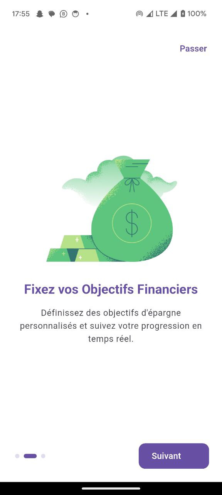
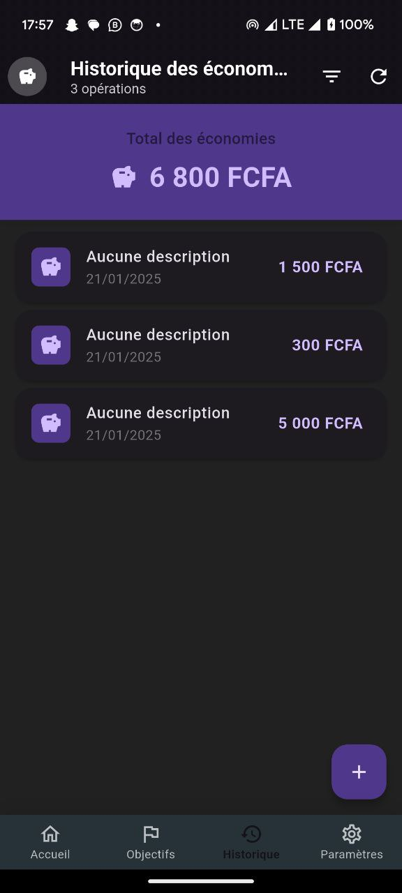
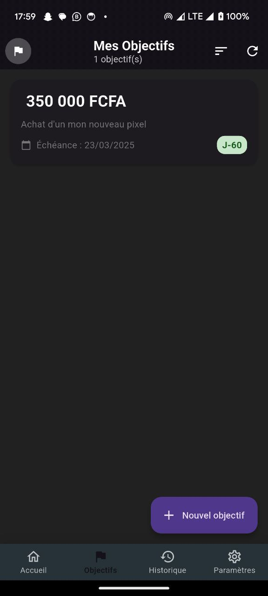
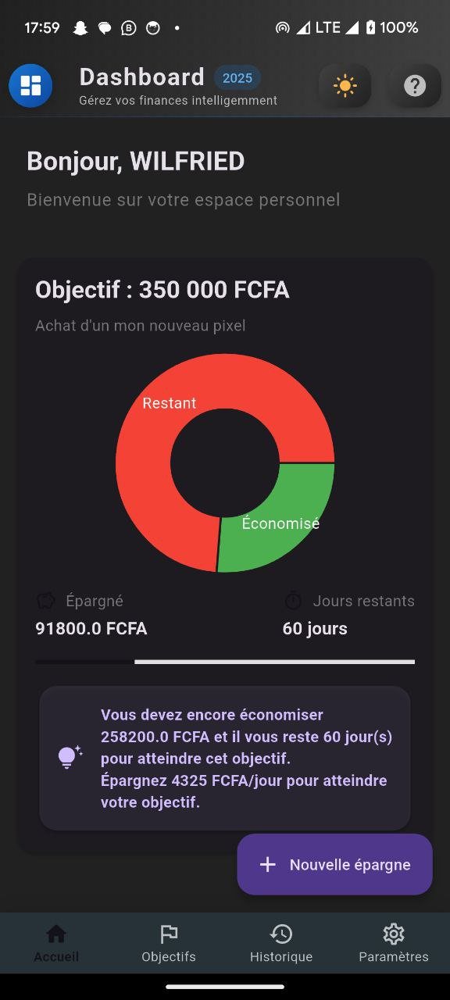

# 📱 CashFlow - Application de Suivi d'Épargne Physique


## 📋 Présentation
CashFlow est une application mobile développée avec Flutter qui permet aux utilisateurs de suivre facilement leurs économies physiques. Conçue pour être simple et intuitive, elle aide à gérer l'argent conservé dans une caisse à domicile, à définir des objectifs d'épargne concrets et à visualiser la progression vers ces objectifs.

## ✨ Fonctionnalités principales

- 👤 **Gestion de compte personnalisée**
  - Création de compte sécurisé
  - Authentification simplifiée

- 💰 **Suivi des économies physiques**
  - Enregistrement des montants déposés dans la caisse
  - Historique détaillé des dépôts
  - Vue d'ensemble du solde actuel de la caisse

- 🎯 **Objectifs d'épargne**
  - Création d'objectifs personnalisés (ex: achat d'un téléphone)
  - Définition du montant cible
  - Suivi en temps réel de la progression

- 📊 **Analyses et rapports**
  - Visualisation de l'évolution de l'épargne
  - Statistiques des dépôts
  - Suivi des objectifs atteints

## 🚀 Installation

1. **Prérequis**
```bash
- Flutter (version 3.0.0 ou supérieure)
- Dart (version 2.17.0 ou supérieure)
- Android Studio / VS Code
```

2. **Configuration**
```bash
# Cloner le repository
git clone https://github.com/Noubissie237/cashflow.git

# Accéder au dossier
cd cashflow

# Installer les dépendances
flutter pub get
```

3. **Lancement**
```bash
# Lancer l'application en mode debug
flutter run
```

## 🛠️ Technologies utilisées
- **Flutter** - Framework UI
- **Dart** - Langage de programmation
- **SQLite** - Base de données locale
- **shared_preferences** - Stockage local des préférences

## 📱 Captures d'écran
<div style="display: flex; flex-wrap: wrap; gap: 10px;">
  
  
  
  
  
  
</div>
## 🔐 Sécurité
- Authentification sécurisée
- Données stockées localement sur l'appareil
- Protection par mot de passe
- Validation des entrées utilisateur

## 🎯 Roadmap
- [ ] Ajout de la synchronisation cloud
- [ ] Support des devises multiples
- [ ] Export des données en PDF
- [ ] Mode sombre/clair
- [ ] Widget pour écran d'accueil
- [ ] Support des notifications push

## 🤝 Contribution
Les contributions sont les bienvenues ! Pour contribuer :

1. Forkez le projet
2. Créez une branche pour votre fonctionnalité
```bash
git checkout -b feature/AmazingFeature
```
3. Committez vos changements
```bash
git commit -m 'Add some AmazingFeature'
```
4. Poussez vers la branche
```bash
git push origin feature/AmazingFeature
```
5. Ouvrez une Pull Request

## 📄 Licence
Ce projet est sous licence MIT - voir le fichier [LICENSE.md](LICENSE) pour plus de détails.

## 📞 Contact
NOUBISSIE KAMGA WILFRIED
- WhatsApp: +237690232120

Lien du projet: [https://github.com/Noubissie237/cashflow](https://github.com/Noubissie237/cashflow)

## 🙏 Remerciements
- [Flutter](https://flutter.dev)
- [Icons8](https://icons8.com) pour les icônes
- Tous les contributeurs qui participent à ce projet

---
⭐️ Si ce projet vous a aidé, n'hésitez pas à lui donner une étoile !